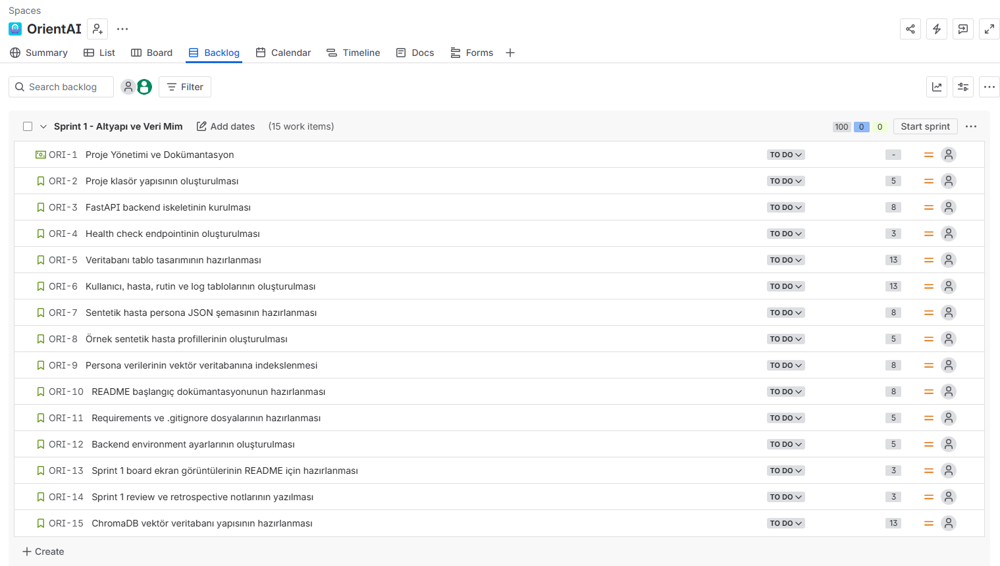
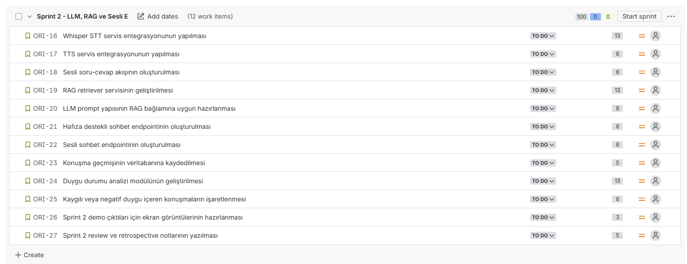
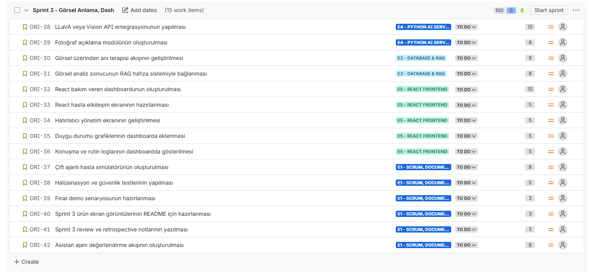

<div align="center">

# 🧭 OrientAI

### Multimodal Orientation and Memory Support Assistant for Dementia Care

**OrientAI** is an AI-powered cognitive support assistant designed to help individuals with mild to moderate dementia maintain orientation, recall personal memories, follow daily routines, and receive multimodal support through voice, vision, and personalized memory retrieval.

</div>

---

<div align="center">


</div>

---

## 📌 Project Overview

**OrientAI** is a multimodal AI assistant developed to support individuals with mild to moderate dementia and their caregivers.

Dementia and Alzheimer’s disease may cause difficulties in short-term memory, orientation, daily routine management, and recognition of familiar people, objects, or situations. OrientAI aims to reduce these challenges by combining:

- Voice-based interaction
- Visual understanding
- Personalized memory retrieval
- Daily routine and medication support
- Sentiment analysis
- Caregiver monitoring dashboard

The system is designed as a **non-clinical cognitive support prototype** and does not provide medical diagnosis, treatment, or emergency decision-making.

---

## 🎯 Problem

Individuals with dementia may experience:

- Repeated questions due to memory loss
- Forgetting medication or daily routines
- Difficulty recognizing familiar people, objects, or environments
- Confusion about time, place, or current situation
- Increased dependency on caregivers

At the same time, caregivers often face emotional and physical burden due to continuous monitoring responsibilities.

---

## 💡 Our Solution

OrientAI provides an AI-powered support layer that helps patients stay oriented and helps caregivers track the patient’s daily status.

The assistant can:

- Understand voice input
- Respond with generated speech
- Retrieve personalized memories using RAG
- Analyze images and connect them with patient memories
- Track conversations, routines, and emotional state
- Provide caregivers with a dashboard for monitoring

---

## ✨ Key Features

| Feature | Description |
|---|---|
| 🎙️ Voice Interaction | Patients can ask questions using speech. |
| 🔊 Text-to-Speech | The assistant can respond with generated voice output. |
| 🧠 Personalized Memory Support | RAG-based retrieval from synthetic patient memories. |
| 🖼️ Visual Understanding | Image analysis for objects, people, and context. |
| 🗓️ Routine Tracking | Daily routines and medication reminders. |
| 📊 Caregiver Dashboard | Visual monitoring of logs, routines, and emotional state. |
| 😊 Sentiment Analysis | Detection of anxious, negative, neutral, or positive interactions. |
| 🤖 Dual-Agent Simulation | AI-based patient simulator and assistant evaluation flow. |
| 🛡️ Safety-Oriented Prompting | Hallucination reduction and safe response design. |

---

## 👥 Target Audience

- Individuals with mild to moderate dementia
- Alzheimer’s patients
- Family caregivers
- Elderly care centers
- Non-clinical cognitive support systems

---

## 🧱 System Architecture

```text
React Frontend
     |
     v
Node.js Backend API
     |
     v
Python AI Services
     |
     |------------------|------------------|------------------|
     v                  v                  v                  v
 Whisper STT        TTS Service       Vision Service       RAG Service
 Audio -> Text      Text -> Audio     Image Analysis       ChromaDB
     |                  |                  |                  |
     |------------------|------------------|------------------|
                            |
                            v
                   Personalized AI Response
                            |
          --------------------------------------
          |                                    |
          v                                    v
   Patient Interaction UI             Caregiver Dashboard
```

---

## 🛠️ Tech Stack

| Layer | Technologies |
|---|---|
| Frontend | React, Vite |
| Backend API | Node.js, Express.js |
| AI Services | Python |
| Speech-to-Text | Whisper |
| Text-to-Speech | TTS Services |
| Multimodal AI | LLaVA / Vision API |
| RAG | ChromaDB |
| Database | PostgreSQL / SQL Server |
| Project Management | Jira |
| Version Control | Git, GitHub |

### Local voice API

Start the Python voice service from the repository root with:

```powershell
python -m service --reload
```

The service listens on `http://127.0.0.1:8000`. The command is safe to run
again: if the OrientAI API is already running, it reuses that instance instead
of starting a second server and causing Windows error 10048. To use a different
port, run `python -m service --reload --port 8001` and set the frontend's
`VITE_VOICE_API_URL` to the matching address.

Whisper defaults to the portable CPU/int8 mode. A machine with the complete
CUDA runtime installed can opt into GPU inference by setting
`WHISPER_DEVICE=cuda` and `WHISPER_COMPUTE_TYPE=float16` before startup.

Before transcription, browser recordings are converted to mono 16 kHz PCM,
filtered to the speech frequency band, conservatively denoised, and loudness
normalized. Browser capture also requests echo cancellation, noise suppression,
and automatic gain control. The processor deliberately avoids a hard noise gate
so quiet speech and natural pauses are preserved.

### Turkish sentiment and anxiety analysis

The orchestrator uses `savasy/bert-base-turkish-sentiment-cased` as its Turkish
positive/negative transformer. A transparent care-domain calibration layer adds
`neutral` and `anxious`, handles common Turkish negations, and exposes the
signals behind the decision. The async service returns `label`, `score`, all
four class scores, `low_confidence`, `needs_attention`, and the model name.

The voice endpoint runs this analysis immediately after transcription and
returns it under the `sentiment` field. The React screen renders the main
emotion, routing-confidence score, low-confidence warning, and an attention
message for anxious or negative speech. This reflects the transcribed content,
not acoustic prosody such as pitch or speaking speed.

The same screen also accepts typed input through `POST /api/text/analyze`.
Typed text skips Whisper and goes directly to the same sentiment service, so
voice and text results use one consistent label and confidence contract. The
frontend keeps both input types in a conversation-style analysis history while
the answer-generation model is inactive.

A separate transparent Turkish safety-intent layer detects explicit violent
threats and self-harm intent before neutral sentiment calibration. Its result is
returned under `sentiment.safety` with `label`, `severity`, `score`,
`needs_attention`, and matched signals. Reported or fictional threats are kept
as low-severity context, while benign uses such as lighting a stove remain
safe. Safety matches override the old neutral fallback and appear as a prominent
human-review warning in the React analysis card.

Neutral confidence is no longer a fixed 0.75. When the binary transformer and
care-domain neutral rule disagree, the calibrated neutral confidence is reduced
and can be marked `low_confidence`, making the source of uncertainty visible.

The model is loaded lazily and cached locally after its first download. Set
`SENTIMENT_LOCAL_FILES_ONLY=true` to prohibit network fallback in provisioned
or offline environments. The model can be changed with `SENTIMENT_MODEL_NAME`.
The returned score is a routing-confidence heuristic, not a clinical probability
or diagnosis; anxious/negative results indicate that the assistant should reply
carefully or request human review according to product policy.

Run the deterministic tests and real-model evaluations with:

```powershell
python -m unittest discover -s tests -v
python -m tests.evaluate_sentiment
python -m tests.evaluate_sentiment --fixture tests/fixtures/sentiment_holdout_cases.json
python -m tests.evaluate_sentiment --fixture tests/fixtures/sentiment_robustness_cases.json
python -m tests.evaluate_sentiment --fixture tests/fixtures/sentiment_adversarial_cases.json
```

These synthetic tests are regression evidence for the prototype, not clinical
validation or a replacement for evaluation on consented target-user speech.

---

## 🧪 Synthetic Data Approach

Due to privacy and ethical concerns, OrientAI does not use real patient data during development.

Instead, the system uses fully synthetic personas that include patient metadata, daily routines, medication reminders, core memories, family-related information, and simulated conversation patterns.

```json
{
  "patient_id": "P-10942",
  "metadata": {
    "name": "Ahmet Yılmaz",
    "age": 74,
    "diagnosis": "Early Stage Alzheimer",
    "former_profession": "History Teacher"
  },
  "daily_routines": [
    {
      "time": "08:30",
      "action": "Take morning medication"
    }
  ],
  "core_memories": [
    {
      "category": "family",
      "content": "His oldest granddaughter's name is Ayşe.",
      "keywords": ["granddaughter", "Ayşe", "family"]
    }
  ]
}
```

---

## 👨‍👩‍👧 Team

### Team Name

**Team OrientAI**

## Team & Role Distribution

| Team Member | Role | Coding Responsibilities |
|---|---|---|
| Senanur ŞENOL | Scrum Master & Data/Prompt Developer | Jira board management, sprint tracking, synthetic patient personas, prompt templates, test scenarios, hallucination test cases, demo data and documentation |
| Eralp DUMAN | AI & Model Integration Developer | Python AI services, Whisper STT, TTS, Vision API/LLaVA integration, model service layer, AI pipeline design and model inference testing |
| Emrullah BOZKURT | Backend Developer | Node.js backend architecture, API routes, request/response schemas, service orchestration, backend configuration and API reliability |
| Gamze AKEMOĞLU | Database & RAG Developer | SQL schema, ChromaDB vector store, persona indexing, RAG retriever, interaction log management and data consistency |
| Elif Sıla DEMİRELİ | Frontend & UI Developer | React patient interaction screen, caregiver dashboard, reminder UI, sentiment charts, log tables and user experience design |

Although each member has a primary role, all team members contribute code through their assigned modules. The project is divided into modular components to ensure balanced technical contribution across the team.

---

## 📋 Product Backlog

[Jira Product Backlog](https://senanursenol4.atlassian.net/jira/software/projects/ORI/boards/67/backlog)

---

# 🚀 Sprint Planning

The project is planned as a **6-week Agile/Scrum development process** consisting of **3 sprints**.

| Sprint | Focus Area | Estimated Points |
|---|---|---:|
| Sprint 1 | Infrastructure and Data Architecture | 100 SP |
| Sprint 2 | LLM, RAG and Voice Interaction | 100 SP |
| Sprint 3 | Vision, Dashboard and Final Testing | 100 SP |

---

# Sprint 1 — Infrastructure and Data Architecture

## Sprint Goal

The goal of Sprint 1 is to establish the core project structure, Node.js backend skeleton, Python AI service skeleton, database schema, React frontend skeleton, synthetic patient persona structure, and initial ChromaDB-based RAG infrastructure.

## Sprint Backlog

| Task | Status |
|---|---|
| Project folder structure setup | To Do |
| Node.js backend skeleton setup | To Do |
| Health check endpoint implementation | To Do |
| Database schema design | To Do |
| User, patient, routine and log tables | To Do |
| Synthetic patient persona JSON schema | To Do |
| Sample synthetic patient profiles | To Do |
| Persona indexing into vector database | To Do |
| Initial README documentation | To Do |
| Package, requirements and .gitignore setup | To Do |
| Node.js backend and Python AI services environment configuration | To Do |
| Sprint 1 board screenshots | To Do |
| Sprint 1 review and retrospective notes | To Do |
| ChromaDB vector database setup | To Do |
| Python AI service skeleton setup | To Do |
| React frontend skeleton setup | To Do |

## Sprint Board



## Sprint Review

To be completed at the end of Sprint 1.

## Sprint Retrospective

To be completed at the end of Sprint 1.

---

# Sprint 2 — LLM, RAG and Voice Interaction

## Sprint Goal

The goal of Sprint 2 is to develop the voice interaction layer, RAG-supported memory retrieval, LLM prompting structure, speech-to-text, text-to-speech, sentiment analysis modules, Node.js chat endpoints, and initial React patient chat interface.

## Sprint Backlog

| Task | Status |
|---|---|
| Whisper STT service integration | To Do |
| TTS service integration | To Do |
| Voice question-answering flow | To Do |
| RAG retriever service development | To Do |
| LLM prompt design for RAG context | To Do |
| Memory-supported chat endpoint | To Do |
| Voice chat endpoint | To Do |
| Conversation history logging | To Do |
| Sentiment analysis module | To Do |
| Flagging anxious or negative conversations | To Do |
| Sprint 2 demo screenshots | To Do |
| Sprint 2 review and retrospective notes | To Do |
| React patient chat screen and API connection draft | To Do |

## Sprint Board



## Sprint Review

To be completed at the end of Sprint 2.

## Sprint Retrospective

To be completed at the end of Sprint 2.

---

# Sprint 3 — Vision, Dashboard and Final Testing

## Sprint Goal

The goal of Sprint 3 is to complete visual understanding, image-based memory therapy, React caregiver dashboard, dual-agent simulation, hallucination testing, and final demo preparation.

## Sprint Backlog

| Task | Status |
|---|---|
| LLaVA or Vision API integration | To Do |
| Photo description module | To Do |
| Image-based memory therapy flow | To Do |
| Connecting visual analysis with RAG memory | To Do |
| React caregiver dashboard | To Do |
| React patient interaction screen | To Do |
| Reminder management screen | To Do |
| Sentiment charts on dashboard | To Do |
| Conversation and routine logs on dashboard | To Do |
| Dual-agent patient simulator | To Do |
| Hallucination and safety testing | To Do |
| Final demo scenario | To Do |
| Sprint 3 product screenshots | To Do |
| Sprint 3 review and retrospective notes | To Do |
| Assistant agent evaluation flow | To Do |

## Sprint Board



## Sprint Review

To be completed at the end of Sprint 3.

## Sprint Retrospective

To be completed at the end of Sprint 3.

---

## 📸 Screenshots

```text
assets/
└── sprint_boards/
    ├── sprint_1_backlog.png
    ├── sprint_2_backlog.png
    └── sprint_3_backlog.png
```

---

## 🔒 Ethics and Privacy

OrientAI does not use real patient data during development or testing.

All patient profiles, memories, routines, and conversations are synthetically generated. The project is designed only as a cognitive support and caregiver-assistance prototype. It is not intended for clinical diagnosis, treatment, or emergency medical decision-making.

---

## 📍 Project Status

```text
Current Stage: Sprint Planning and Repository Setup
```

---

<div align="center">

### OrientAI  
#### Supporting orientation, memory, and daily life through multimodal AI.

</div>
