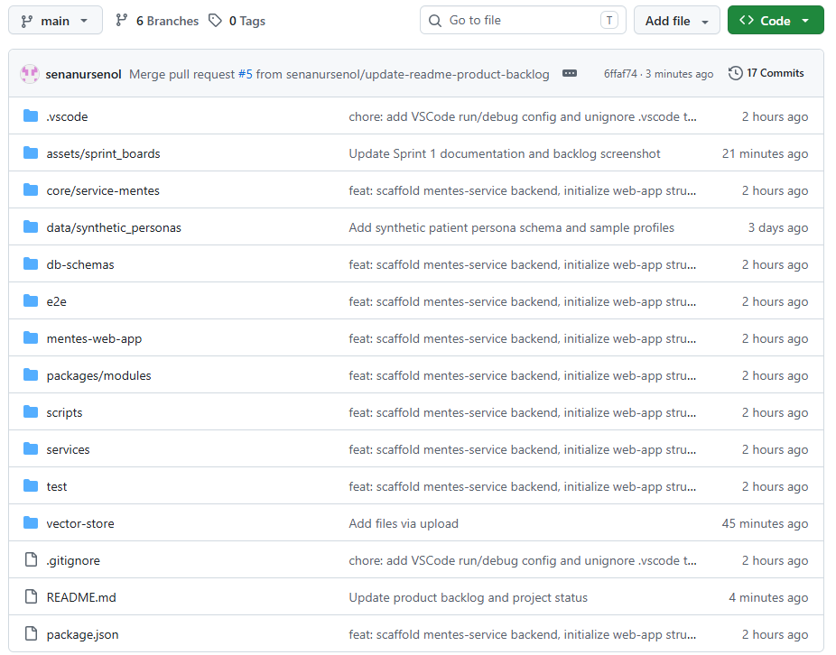
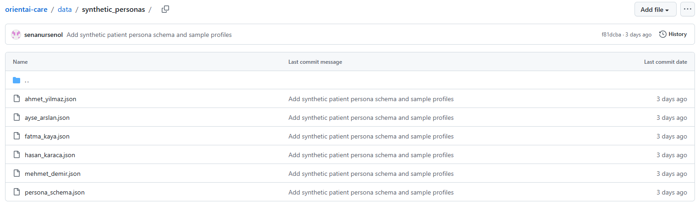
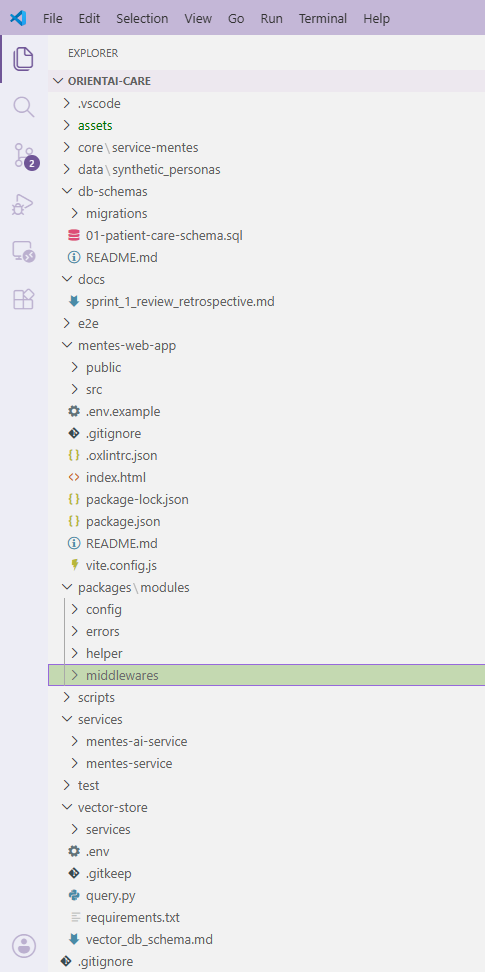
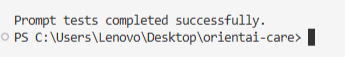
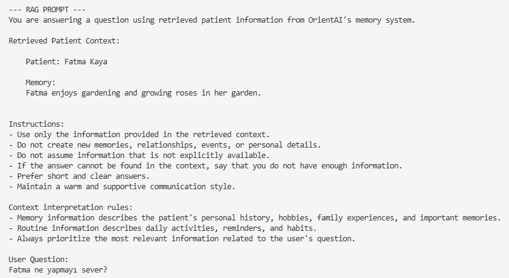
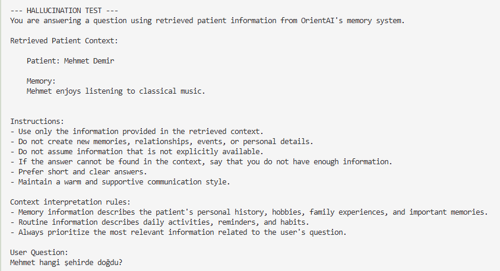
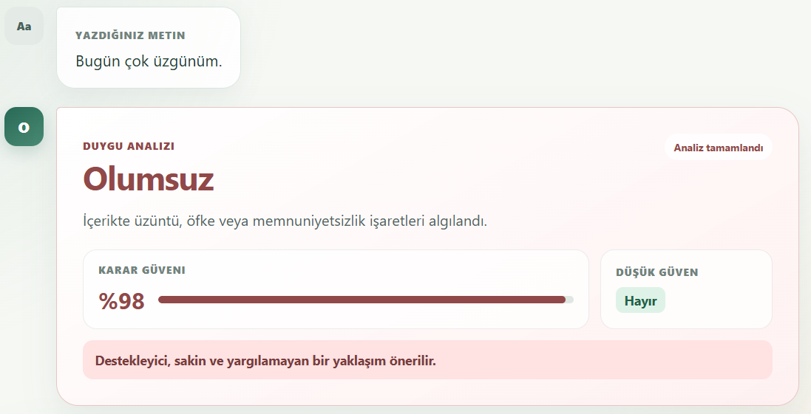
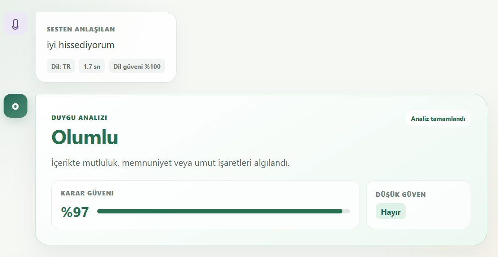
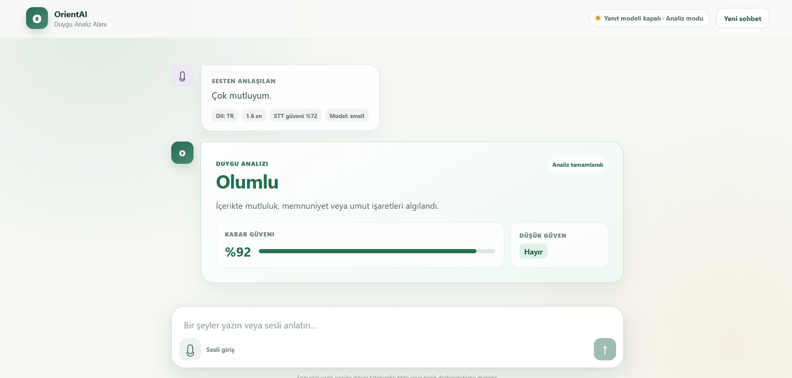
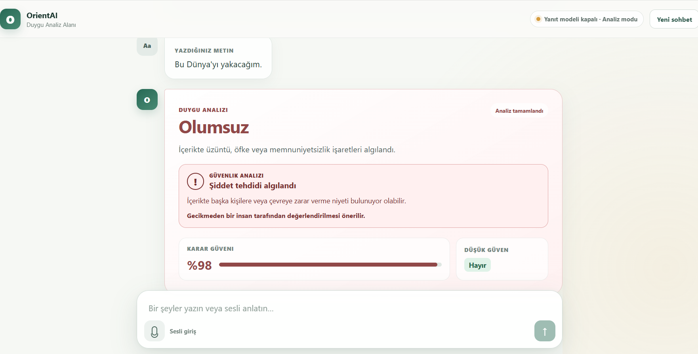

<div align="center">

# 🧭 OrientAI

### Multimodal Orientation and Memory Support Assistant for Dementia Care

**OrientAI** is an AI-powered cognitive support assistant designed to help individuals with mild to moderate dementia maintain orientation, recall personal memories, follow daily routines, and receive multimodal support through voice, vision, and personalized memory retrieval.

</div>

---

<div align="center">


</div>

---

## 📌 Project Overview

**OrientAI** is a multimodal AI assistant developed to support individuals with mild to moderate dementia and their caregivers.

Dementia and Alzheimer’s disease may cause difficulties in short-term memory, orientation, daily routine management, and recognition of familiar people, objects, or situations. OrientAI aims to reduce these challenges by combining:

- Voice-based interaction
- Visual understanding
- Personalized memory retrieval
- Daily routine and medication support
- Sentiment analysis
- Caregiver monitoring dashboard

The system is designed as a **non-clinical cognitive support prototype** and does not provide medical diagnosis, treatment, or emergency decision-making.

---

## 🎯 Problem

Individuals with dementia may experience:

- Repeated questions due to memory loss
- Forgetting medication or daily routines
- Difficulty recognizing familiar people, objects, or environments
- Confusion about time, place, or current situation
- Increased dependency on caregivers

At the same time, caregivers often face emotional and physical burden due to continuous monitoring responsibilities.

---

## 💡 Our Solution

OrientAI provides an AI-powered support layer that helps patients stay oriented and helps caregivers track the patient’s daily status.

The assistant can:

- Understand voice input
- Respond with generated speech
- Retrieve personalized memories using RAG
- Analyze images and connect them with patient memories
- Track conversations, routines, and emotional state
- Provide caregivers with a dashboard for monitoring

---

## ✨ Key Features

| Feature | Description |
|---|---|
| 🎙️ Voice Interaction | Patients can ask questions using speech. |
| 🔊 Text-to-Speech | The assistant can respond with generated voice output. |
| 🧠 Personalized Memory Support | RAG-based retrieval from synthetic patient memories. |
| 🖼️ Visual Understanding | Image analysis for objects, people, and context. |
| 🗓️ Routine Tracking | Daily routines and medication reminders. |
| 📊 Caregiver Dashboard | Visual monitoring of logs, routines, and emotional state. |
| 😊 Sentiment Analysis | Detection of anxious, negative, neutral, or positive interactions. |
| 🤖 Dual-Agent Simulation | AI-based patient simulator and assistant evaluation flow. |
| 🛡️ Safety-Oriented Prompting | Hallucination reduction and safe response design. |

---

## 👥 Target Audience

- Individuals with mild to moderate dementia
- Alzheimer’s patients
- Family caregivers
- Elderly care centers
- Non-clinical cognitive support systems

---

## 🧱 System Architecture

```text
React Frontend
     |
     v
Node.js Backend API
     |
     v
Python AI Services
     |
     |------------------|------------------|------------------|
     v                  v                  v                  v
 Whisper STT        TTS Service       Vision Service       RAG Service
 Audio -> Text      Text -> Audio     Image Analysis       ChromaDB
     |                  |                  |                  |
     |------------------|------------------|------------------|
                            |
                            v
                   Personalized AI Response
                            |
          --------------------------------------
          |                                    |
          v                                    v
   Patient Interaction UI             Caregiver Dashboard
```

---

## 🛠️ Tech Stack

| Layer | Technologies |
|---|---|
| Frontend | React, Vite |
| Backend API | Node.js, Express.js |
| AI Services | Python |
| Speech-to-Text | Whisper |
| Text-to-Speech | TTS Services |
| Multimodal AI | LLaVA / Vision API |
| RAG | ChromaDB |
| Database | PostgreSQL / SQL Server |
| Project Management | Jira |
| Version Control | Git, GitHub |

---

## 🧪 Synthetic Data Approach

Due to privacy and ethical concerns, OrientAI does not use real patient data during development.

Instead, the system uses fully synthetic personas that include patient metadata, daily routines, medication reminders, core memories, family-related information, and simulated conversation patterns.

```json
{
  "patient_id": "P-10942",
  "metadata": {
    "name": "Ahmet Yılmaz",
    "age": 74,
    "diagnosis": "Early Stage Alzheimer",
    "former_profession": "History Teacher"
  },
  "daily_routines": [
    {
      "time": "08:30",
      "action": "Take morning medication"
    }
  ],
  "core_memories": [
    {
      "category": "family",
      "content": "His oldest granddaughter's name is Ayşe.",
      "keywords": ["granddaughter", "Ayşe", "family"]
    }
  ]
}
```

---

## 👨‍👩‍👧 Team

### Team Name

**Team OrientAI**

## Team & Role Distribution

| Team Member | Role | Coding Responsibilities |
|---|---|---|
| Senanur ŞENOL | Scrum Master & Data/Prompt Developer | Jira board management, sprint tracking, synthetic patient personas, prompt templates, test scenarios, hallucination test cases, demo data and documentation |
| Eralp DUMAN | AI & Model Integration Developer | Python AI services, Whisper STT, TTS, Vision API/LLaVA integration, model service layer, AI pipeline design and model inference testing |
| Emrullah BOZKURT | Backend Developer | Node.js backend architecture, API routes, request/response schemas, service orchestration, backend configuration and API reliability |
| Gamze AKEMOĞLU | Database & RAG Developer | SQL schema, ChromaDB vector store, persona indexing, RAG retriever, interaction log management and data consistency |
| Elif Sıla DEMİRELİ | Frontend & UI Developer | React patient interaction screen, caregiver dashboard, reminder UI, sentiment charts, log tables and user experience design |

Although each member has a primary role, all team members contribute code through their assigned modules. The project is divided into modular components to ensure balanced technical contribution across the team.

---

## 📋 Product Backlog

The product backlog was created and managed in Jira. It contains the main development tasks required to build OrientAI, including infrastructure setup, backend development, AI services, RAG integration, voice interaction, visual understanding, caregiver dashboard, testing and documentation.

[Jira Product Backlog](https://senanursenol4.atlassian.net/jira/software/projects/ORI/boards/67/backlog)

| Epic | Backlog Focus |
|---|---|
| E1 - Scrum, Documentation & Testing | Sprint planning, README documentation, review notes, retrospective notes, screenshots, simulation and testing documentation |
| E2 - Node.js Backend API | Backend skeleton, health check endpoint, chat endpoints, voice chat endpoint and API orchestration |
| E3 - Database & RAG | Database schema, user/patient/routine/log tables, ChromaDB setup, persona indexing and RAG retriever |
| E4 - Python AI Services | Python AI service skeleton, Whisper STT, TTS, sentiment analysis, LLM/VLM integration and AI service layer |
| E5 - React Frontend | React frontend skeleton, patient chat screen, caregiver dashboard, reminder UI, sentiment charts and log tables |

---

# 🚀 Sprint Planning

The project is planned as a **6-week Agile/Scrum development process** consisting of **3 sprints**.

| Sprint | Focus Area | Estimated Points |
|---|---|---:|
| Sprint 1 | Infrastructure and Data Architecture | 100 SP |
| Sprint 2 | LLM, RAG and Voice Interaction | 100 SP |
| Sprint 3 | Vision, Dashboard and Final Testing | 100 SP |

---

# Sprint 1 - Infrastructure and Data Architecture

## Sprint Status

Completed

## Sprint Duration

29 June 2026 - 9 July 2026

## Sprint Goal

The goal of Sprint 1 was to establish the initial project infrastructure of OrientAI, including the Node.js backend skeleton, Python AI service skeleton, React frontend skeleton, database schema, ChromaDB/RAG foundation, synthetic patient persona structure, environment configuration, and initial project documentation.

## Sprint Backlog

| Task | Status |
|---|---|
| ORI-2 - Project folder structure setup | Done |
| ORI-3 - Node.js backend skeleton setup | Done |
| ORI-4 - Health check endpoint implementation | Done |
| ORI-5 - Database schema design | Done |
| ORI-6 - User, patient, routine and log tables | Done |
| ORI-7 - Synthetic patient persona JSON schema | Done |
| ORI-8 - Sample synthetic patient profiles | Done |
| ORI-9 - Persona indexing into vector database | Done |
| ORI-10 - Initial README documentation | Done |
| ORI-11 - Package, requirements and .gitignore setup | Done |
| ORI-12 - Node.js backend and Python AI services environment configuration | Done |
| ORI-13 - Sprint 1 board screenshots | Done |
| ORI-14 - Sprint 1 review and retrospective notes | Done |
| ORI-15 - ChromaDB vector database setup | Done |
| ORI-52 - Python AI service skeleton setup | Done |
| ORI-58 - React frontend skeleton setup | Done |

## Sprint Board


## Sprint 1 Review

Sprint 1 focused on preparing the initial infrastructure and data architecture of OrientAI. The team created the foundation required for the following development phases, including backend, frontend, AI services, database, RAG infrastructure, synthetic patient data, and documentation.

During this sprint, the Jira Scrum board was organized, epics were created, Sprint 1 tasks were assigned, responsibilities were clarified, and the first development outputs were added to the GitHub repository.

## Product Status Screenshots

### Repository Structure



### Synthetic Patient Persona Files



### Local Project Structure



## Completed Outputs

### Project and Scrum Setup

- Jira Scrum project was created and configured.
- Sprint 1, Sprint 2 and Sprint 3 backlogs were organized.
- Project epics were created and linked to related work items.
- Sprint 1 goal was defined.
- Team roles and responsibilities were clarified.
- Story points and task assignments were completed.
- Sprint 1 board screenshot was added to the documentation.

### Repository and Folder Structure

The initial repository structure was prepared for modular development. This structure allows backend, frontend, AI services, database, RAG, simulation, documentation, and assets to be developed separately by the responsible team members.

### Backend Infrastructure

- Node.js backend skeleton was prepared.
- Basic backend project structure was created.
- Health check endpoint was implemented.
- Backend environment configuration was prepared.

### Python AI Services Infrastructure

- Python AI service skeleton was prepared.
- Initial AI service folder structure was created.
- The structure was prepared for future STT, TTS, LLM, RAG, and vision service integrations.

### React Frontend Infrastructure

- React frontend skeleton was prepared.
- Initial frontend folder structure was created.
- The structure was prepared for future patient chat screen, caregiver dashboard, reminder management, and API connection features.

### Database and RAG Foundation

- Database schema design was prepared.
- User, patient, routine, and log table structures were planned.
- Initial ChromaDB vector database structure was prepared.
- Persona indexing structure was prepared for the RAG pipeline.

### Synthetic Patient Persona Data

A reusable JSON schema and five diverse synthetic dementia/Alzheimer patient profiles were created.

Added files:

- `data/synthetic_personas/persona_schema.json`
- `data/synthetic_personas/ahmet_yilmaz.json`
- `data/synthetic_personas/fatma_kaya.json`
- `data/synthetic_personas/mehmet_demir.json`
- `data/synthetic_personas/ayse_arslan.json`
- `data/synthetic_personas/hasan_karaca.json`

The JSON files were validated using `python -m json.tool`.

### Persona Diversity

| Persona | Disease Stage | Main Focus |
|---|---|---|
| Ahmet Yılmaz | Mild Alzheimer | Family recall, teacher background, orientation support |
| Fatma Kaya | Moderate Dementia | Visual memory, sewing memories, family photo support |
| Mehmet Demir | Moderate Alzheimer | Medication routine, blood pressure routine, caregiver support |
| Ayşe Arslan | Mild Alzheimer | Independent living, plant care, caregiver visit tracking |
| Hasan Karaca | Moderate Dementia | Visual memory, seaside memories, emotional safety |

## Sprint 1 Retrospective

### What Went Well

- The project scope became clearer after defining the OrientAI product name.
- Jira epics, tasks, story points, and sprint structure were organized successfully.
- Team responsibilities became more understandable.
- The initial repository structure was organized according to the selected technology stack.
- Backend, frontend, AI services, database, and RAG responsibilities were separated clearly.
- Synthetic patient persona data was created in a detailed and reusable format.
- Five patient personas were designed with different backgrounds, routines, and memory contexts.
- The first GitHub workflow was completed successfully with branch, commit, push, pull request, and merge steps.

### What Could Be Improved

- Some Jira task descriptions were missing at the beginning and had to be updated later.
- The difference between Sprint 1, Sprint 2, and Sprint 3 responsibilities needed clarification.
- Some tasks were initially too broad and required better separation by technology area.
- GitHub branches and Jira statuses should be synchronized more consistently.
- Future commits should reference related Jira tasks more clearly.

### Challenges

- Aligning the Jira backlog with the updated technology stack required extra edits.
- Sprint 1 infrastructure tasks had to be separated from later prompt, RAG, simulation, and testing tasks.
- Since multiple technologies are used in the project, the initial folder structure and task ownership needed careful planning.
- The team needed to keep README documentation, Jira status, and GitHub outputs consistent.

### Action Items for Sprint 2

- Keep Jira task descriptions consistent using User Story and Acceptance Criteria format.
- Ensure every completed task has a matching GitHub commit or documentation output.
- Start Sprint 2 with a clear focus on LLM, RAG, and voice interaction features.
- Define prompt structure and RAG response rules in Sprint 2.
- Connect frontend, backend, AI services, and database outputs more consistently.
- Update README after each major sprint output.
- Keep Jira statuses synchronized with GitHub pull requests.

## Sprint 1 Documentation

- [Sprint 1 Daily Scrum Notes](docs/sprint_1_daily_scrum.md)
- [Sprint 1 Review and Retrospective](docs/sprint_1_review_retrospective.md)
---

# Sprint 2 - LLM, RAG and Voice Interaction

## Sprint Status

Completed

## Sprint Duration

6 July 2026 - 19 July 2026

## Sprint Goal

The goal of Sprint 2 was to develop the core AI interaction capabilities of OrientAI by implementing the voice interaction layer, RAG-supported memory retrieval pipeline, LLM prompt structure, Speech-to-Text (STT), Text-to-Speech (TTS), sentiment analysis modules, backend API flows and the initial React patient interaction interface.

During this sprint, OrientAI gained the ability to process user voice and text inputs, analyze emotional states, retrieve patient-related memories through RAG, and present AI analysis results through the frontend interface.

---

## Sprint Backlog

| Task | Status |
|---|---|
| Whisper STT service integration | Done |
| TTS service integration | Done |
| Voice question-answering flow | Done |
| RAG retriever service development | Done |
| LLM prompt design for RAG context | Done |
| Memory-supported chat endpoint | Done |
| Voice chat endpoint | Done |
| Conversation history logging | Done |
| Sentiment analysis module | Done |
| Flagging anxious or negative conversations | Done |
| Sprint 2 demo screenshots | Done |
| Sprint 2 review and retrospective notes | Done |
| React patient chat screen and API connection draft | Done |

---

## Sprint Board


---

# Product Status Screenshots

Sprint 2 introduced the first functional AI interaction pipeline of OrientAI.

The implemented modules include:

- RAG-based patient memory retrieval
- Voice input processing
- Speech-to-Text conversion
- Text-to-Speech integration
- Sentiment analysis
- Safety-related emotional signal detection
- Frontend visualization of AI analysis results

---

# RAG Prompt Engineering and Validation Tests

The RAG pipeline was improved with prompt engineering rules to ensure that generated responses are based only on retrieved patient information.

Implemented rules:

- Do not generate unavailable memories.
- Do not assume missing patient information.
- Use only retrieved context.
- Provide supportive and patient-oriented responses.

Validation scenarios:

- Context usage validation
- Hallucination prevention
- Memory-grounded response generation


## Prompt Test Result




## RAG Context Test




## Hallucination Prevention Test



---

# Voice Interaction Pipeline

A complete voice processing pipeline was implemented.

```
User Voice Input
        |
        ↓
Audio Processing
        |
        ↓
Whisper STT
        |
        ↓
Text Processing
        |
        ↓
Sentiment Analysis
        |
        ↓
AI Response Generation
        |
        ↓
TTS Response
```

Implemented features:

- Audio input processing
- Speech transcription
- Language detection
- Transcription confidence calculation
- Text-to-speech response generation
- Error handling mechanisms

---

# Sentiment Analysis and Safety Detection

A Turkish sentiment analysis module was implemented to understand user emotional states.

Supported categories:

- Positive
- Negative
- Neutral

The system provides:

- Sentiment label
- Confidence score
- Emotion probability values
- Safety analysis result
- Warning signals

A separate safety detection layer was added to identify potentially critical expressions and attention-required situations.

---

# Frontend Integration

The React frontend was connected with AI service outputs.

Implemented features:

- Text input analysis
- Voice input analysis
- Sentiment visualization
- Confidence score display
- Safety warning visualization
- Voice transcription result display


## Positive Sentiment Example




## Negative Sentiment Example




## Voice Analysis Example




## Voice Positive Sentiment Example



---

# Completed Outputs

## AI Service Development

The Python AI service architecture was expanded with modular components.

```
services/
└── mentes-ai-service/
    └── app/
        └── services/
            ├── stt/
            │   ├── whisper.py
            │   ├── voice_input.py
            │   └── audio_processing.py
            │
            ├── tts/
            │   └── tts.py
            │
            ├── sentiment/
            │   └── sentiment.py
            │
            └── rag/
                ├── retriever_service.py
                ├── query.py
                └── prompt_builder.py
```

---

## Backend API Integration

Backend communication flows were prepared for:

- Patient chat requests
- Voice input requests
- Sentiment analysis requests
- AI service communication

---

## Testing Infrastructure

Testing structure was expanded for AI modules.

Implemented tests:

- Audio processing tests
- STT tests
- Sentiment analysis tests
- Safety detection tests
- RAG prompt validation tests
- Hallucination prevention tests

---

# Sprint 2 Review

Sprint 2 transformed OrientAI from an infrastructure-focused project into a functional AI interaction platform.

Completed achievements:

- Voice interaction capabilities were added.
- STT and TTS pipelines were implemented.
- RAG-based memory retrieval was integrated.
- Prompt rules were developed to reduce hallucination.
- Sentiment analysis and safety detection modules were created.
- Frontend interfaces were connected with AI analysis outputs.

---

# Sprint 2 Documentation

- [Sprint 2 Daily Scrum Notes](docs/sprint_2_daily_scrum.md)
- [Sprint 2 Review and Retrospective](docs/sprint_2_review_retrospective.md)

---

# Sprint 3 — Vision, Dashboard and Final Testing

## Sprint Goal

The goal of Sprint 3 is to complete visual understanding, image-based memory therapy, React caregiver dashboard, dual-agent simulation, hallucination testing, and final demo preparation.

## Sprint Backlog

| Task | Status |
|---|---|
| LLaVA or Vision API integration | To Do |
| Photo description module | To Do |
| Image-based memory therapy flow | To Do |
| Connecting visual analysis with RAG memory | To Do |
| React caregiver dashboard | To Do |
| React patient interaction screen | To Do |
| Reminder management screen | To Do |
| Sentiment charts on dashboard | To Do |
| Conversation and routine logs on dashboard | To Do |
| Dual-agent patient simulator | To Do |
| Hallucination and safety testing | To Do |
| Final demo scenario | To Do |
| Sprint 3 product screenshots | To Do |
| Sprint 3 review and retrospective notes | To Do |
| Assistant agent evaluation flow | To Do |

## Sprint Board


## Sprint Review

To be completed at the end of Sprint 3.

## Sprint Retrospective

To be completed at the end of Sprint 3.

---

## 📸 Screenshots

```text
assets/
└── sprint_boards/
    ├── sprint_1_backlog.png
    ├── sprint_2_backlog.png
    └── sprint_3_backlog.png
```

---

## 🔒 Ethics and Privacy

OrientAI does not use real patient data during development or testing.

All patient profiles, memories, routines, and conversations are synthetically generated. The project is designed only as a cognitive support and caregiver-assistance prototype. It is not intended for clinical diagnosis, treatment, or emergency medical decision-making.

---

## 📍 Project Status

```text
Current Stage: Sprint 1 Completed — Sprint 2 Preparation
```

---

<div align="center">

### OrientAI  
#### Supporting orientation, memory, and daily life through multimodal AI.

</div>
