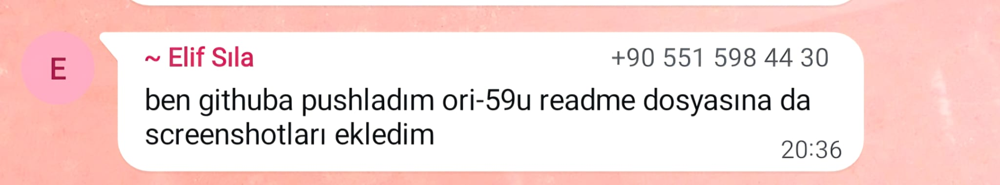
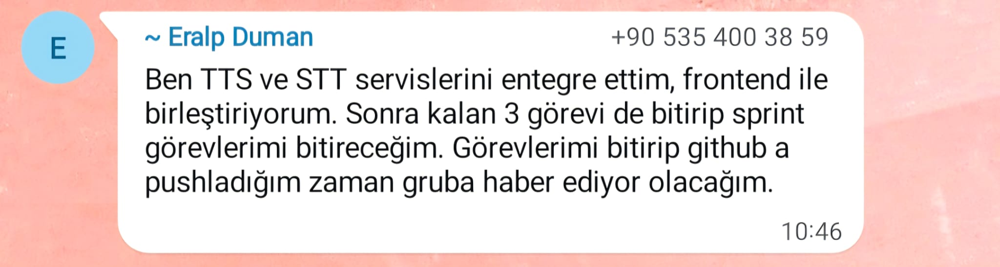
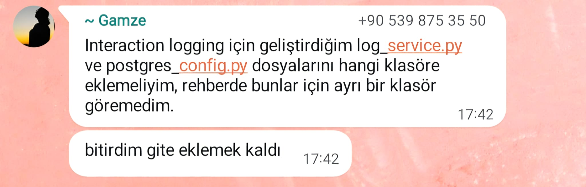

# Sprint 2 Daily Scrum Notes

## Project

OrientAI — Multimodal Cognitive Support Assistant for Dementia and Alzheimer Patients

## Sprint

Sprint 2 - AI Services & Frontend Integration

## Daily Scrum Period

6 July 2026 - 19 July 2026

---

## Daily Scrum Summary

| Date | Focus | Yesterday | Today | Blockers |
|---|---|---|---|---|
| 6 July 2026 | Sprint Start | Sprint 1 outputs and infrastructure tasks were reviewed. | Sprint 2 goals, tasks and responsibilities were organized. | No blocker |
| 7 July 2026 | AI Service Planning | AI service requirements were reviewed. | STT, TTS and sentiment analysis service structures were planned. | No blocker |
| 8 July 2026 | Speech Processing | Voice interaction requirements were analyzed. | Whisper based STT service development started. | No blocker |
| 9 July 2026 | STT Development | Whisper integration was started. | Audio processing and transcription pipeline development continued. | No blocker |
| 10 July 2026 | Sentiment Analysis | Emotion analysis requirements were reviewed. | Turkish sentiment analysis service development started. | No blocker |
| 11 July 2026 | Safety Detection | Sentiment outputs were evaluated. | Safety analysis and risk detection mechanisms were developed. | No blocker |
| 12 July 2026 | RAG Prompt Development | RAG structure from Sprint 1 was reviewed. | Patient context prompts and response rules were prepared. | No blocker |
| 13 July 2026 | Prompt Testing | Initial prompt structures were completed. | RAG context and hallucination prevention tests were performed. | No blocker |
| 14 July 2026 | Frontend Integration | Frontend requirements were reviewed. | AI analysis results started to be displayed on frontend. | No blocker |
| 15 July 2026 | Voice and Text Flow | Input flows were tested. | Text and voice analysis pipelines were integrated. | No blocker |
| 16 July 2026 | Testing | Service outputs were reviewed. | STT, sentiment and safety tests were created. | No blocker |
| 17 July 2026 | Integration Improvements | Integration issues were reviewed. | Service structure improvements and bug fixes were completed. | No blocker |
| 18 July 2026 | Documentation | Sprint outputs were reviewed. | README, screenshots and documentation updates were prepared. | No blocker |
| 19 July 2026 | Sprint Completion | Final sprint outputs were checked. | GitHub updates and Sprint 2 documentation were completed. | No blocker |

---

# Daily Scrum Screenshots

The following screenshots document Sprint 2 team communication, development progress, task coordination and repository workflow updates.

---

## 1. AI Service Development Progress

This screenshot shows team communication about AI service development and Sprint 2 implementation tasks.

---

## 2. STT and TTS Integration Progress

This screenshot documents progress updates related to speech processing services.

---

## 3. Frontend Integration Progress

This screenshot shows communication about frontend integration and displaying AI analysis results.

---

## 4. Task Coordination and Development Updates

This screenshot documents task coordination and Sprint 2 development discussions.

---

## General Notes

- Daily Scrum notes were used to track Sprint 2 progress, responsibilities and development activities.
- No major blocker was recorded during Sprint 2.
- The main focus was AI service development, RAG prompt preparation, frontend integration and testing.
- Team communication screenshots were added as evidence of development coordination.
- Sprint 2 outputs were documented together with review and retrospective notes.