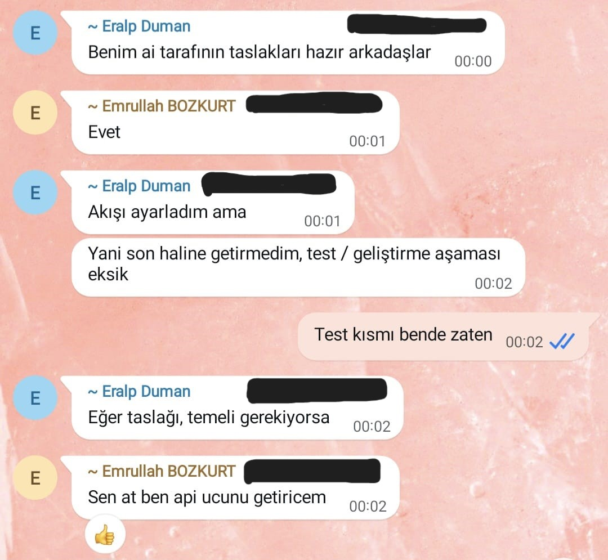
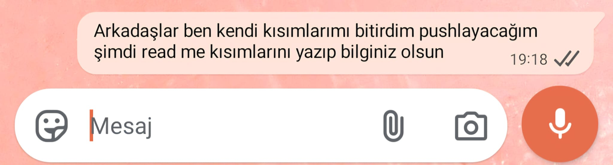
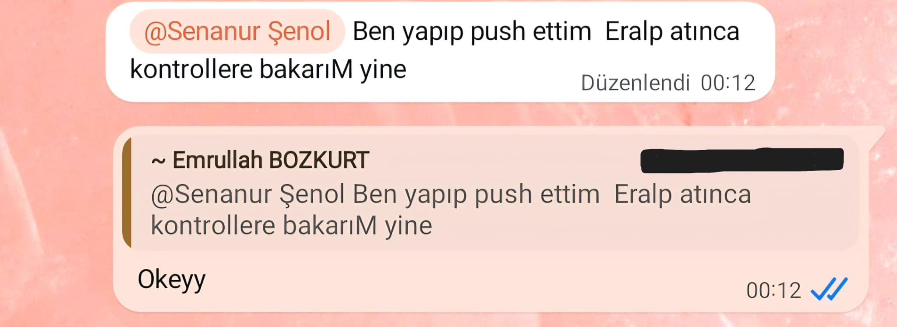
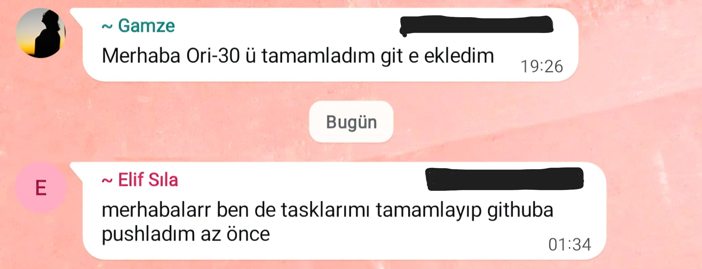

# Sprint 3 Daily Scrum Notes

## Project

OrientAI — Multimodal Cognitive Support Assistant for Dementia and Alzheimer Patients

## Sprint

Sprint 3 - AI Integration, System Integration and Finalization

## Daily Scrum Period

20 July 2026 - 26 July 2026

---

## Daily Scrum Summary

| Date | Focus | Yesterday | Today | Blockers |
|---|---|---|---|---|
| 20 July 2026 | Sprint Start | Sprint 3 goals and remaining tasks were reviewed. | AI integration, frontend, backend and testing tasks were assigned. | No blocker |
| 21 July 2026 | AI Development | AI service architecture and conversation flow were discussed. | AI service implementation and API integration continued. | No blocker |
| 22 July 2026 | Integration Progress | Backend and frontend components progressed independently. | API endpoints and service integration continued. | No blocker |
| 23 July 2026 | Testing Preparation | Core development tasks were completed. | Integration testing responsibilities and validation process were organized. | No blocker |
| 24 July 2026 | Documentation | Feature implementations were finalized. | README documentation and project documentation were updated. | No blocker |
| 25 July 2026 | Repository Integration | Team members completed their assigned tasks. | Completed developments were pushed to GitHub and integration checks were performed. | No blocker |
| 26 July 2026 | Sprint Closing | Final repository status and completed tasks were reviewed. | Sprint Review and Retrospective documents were prepared together with the final project deliverables. | No blocker |

---

## Daily Scrum Screenshots

The following screenshots document Sprint 3 team communication, AI integration discussions, GitHub workflow, documentation updates and final coordination before project delivery.

### 1. AI Development and API Integration Discussion

This screenshot shows the team's discussion about AI service development, API integration and the distribution of testing responsibilities.

### 2. Documentation and README Preparation

This screenshot documents the coordination of README updates and project documentation before the final repository push.

### 3. GitHub Push and Integration Coordination

This screenshot shows communication regarding completed developments, GitHub push operations and integration verification.

### 4. Final Task Completion Updates

This screenshot shows team members confirming the completion of their assigned tasks and uploading the latest changes to the GitHub repository.

---

## General Notes

- Daily Scrum meetings were used to monitor Sprint 3 progress, coordinate AI integration and track repository updates.
- No major blocker was recorded during Sprint 3.
- The primary focus of this sprint was AI service implementation, frontend-backend integration, API development, testing and project documentation.
- Team members regularly synchronized completed tasks through GitHub and verified successful integration before the sprint closed.
- Screenshots were added as evidence of daily communication, collaboration, documentation updates and final project coordination during Sprint 3.