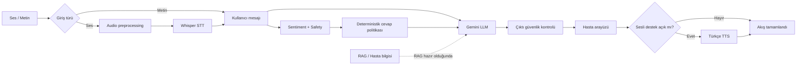

# OrientAI RAG'sız Konuşma Akışı Raporu

## Amaç

Bu çalışma, hasta arayüzündeki yazılı ve sesli mesajları güvenli bir Gemini
yanıtına dönüştüren uçtan uca konuşma akışını gerçekleştirir. RAG veri kaynağı
henüz hazır olmadığı için RAG aşaması bilinçli olarak çağrılmamaktadır. Kod,
ileride doğrulanmış hasta bağlamı ve RAG sonucu eklenebilecek şekilde
hazırlanmıştır.

Fotoğraf açıklama akışı bu çalışmanın dışında tutulmuş ve mevcut haliyle
korunmuştur.

## Gerçekleştirilen akış



## Aşamalar

### 1. Metin girişi

Hasta arayüzü yazılı mesajı `POST /api/chat/text` endpoint'ine gönderir.
Backend mesajı normalize eder ve konuşma orkestratörüne aktarır.

Eski `POST /api/text/analyze` endpoint'i geriye dönük uyumluluk için
korunmuştur; yeni hasta arayüzü bu endpoint'i kullanmaz.

### 2. Ses girişi

Hasta arayüzü mikrofon kaydını `POST /api/chat/voice` endpoint'ine multipart
dosya olarak gönderir. Backend sırasıyla:

1. Dosya türü ve boyutunu doğrular.
2. Mevcut audio preprocessing işlemlerini uygular.
3. Whisper ile Türkçe metne dönüştürür.
4. Transkripsiyon güveni ve dil bilgisini üretir.
5. Ortaya çıkan metni konuşma orkestratörüne gönderir.

Eski `POST /api/voice/transcribe` endpoint'i yalnızca transkripsiyon ve analiz
gereken kullanımlar için korunmuştur.

### 3. Sentiment ve giriş safety analizi

`SentimentService`, kullanıcı metni için aşağıdaki verileri üretir:

- Duygusal etiket: `anxious`, `negative`, `neutral` veya `positive`
- Etiket güven skoru
- Düşük güven işareti
- Kaygı sinyalleri
- Şiddet veya kendine zarar verme gibi ayrı safety sinyalleri
- `safety.needs_attention` kararı

Bu adım tamamlanamazsa LLM çağrılmaz. Böylece safety bilgisi olmadan hasta
yanıtı üretilmez.

### 4. Yanıt politikası

`ResponsePolicyBuilder`, sentiment sonucunu deterministik olarak LLM bağlamına
dönüştürür. Örneğin kaygılı ve yüksek güvenli bir mesaj şu yapıyı üretir:

```json
{
  "emotional_state": "anxious",
  "confidence": "high",
  "response_policy": {
    "tone": "calm_and_reassuring",
    "length": "short",
    "acknowledge_feeling": true,
    "ask_at_most_one_question": true,
    "avoid_confrontation": true
  },
  "safety": {
    "needs_attention": false
  }
}
```

Güven sınıfları şu şekilde hesaplanır:

- `high`: skor en az `0.80` ve sonuç düşük güvenli değil
- `medium`: skor en az `0.58` ve sonuç düşük güvenli değil
- `low`: skor `0.58` altında veya sentiment sonucu düşük güvenli

Yanıt tonu duygu durumuna göre seçilir:

| Duygu / durum | Ton |
| --- | --- |
| Safety ilgisi gerekiyor | `calm_and_direct` |
| Kaygılı | `calm_and_reassuring` |
| Olumsuz | `empathetic_and_supportive` |
| Olumlu | `warm_and_encouraging` |
| Nötr veya bilinmeyen | `calm_and_clear` |

Tüm mevcut politikalar kısa yanıt, en fazla bir soru ve çatışmadan kaçınma
kurallarını kullanır.

### 5. Gemini LLM

`LLMService`, kullanıcı mesajını ve yapılandırılmış politika nesnesini ayrı
bölümler halinde Gemini'ye gönderir.

- API anahtarı yalnızca backend'deki `GEMINI_API_KEY` ortam değişkeninden alınır.
- LLM, vision servisiyle aynı `GEMINI_VISION_MODEL` değerini kullanır.
- Sistem talimatı demans veya Alzheimer ile yaşayabilecek bir hastaya uygun,
  sakin ve açık Türkçe ister.
- Sağlanmamış hasta bilgisi, kişi ilişkisi, anı, teşhis veya olayın
  uydurulması yasaktır.
- Teknik sentiment ve safety etiketlerinin hastaya okunması engellenir.
- Gemini'den yalnızca hastaya gösterilecek nihai metin istenir.

RAG çağrısı yapılmaz. Orkestratör, LLM servisindeki `retrieved_context`
parametresini açıkça `None` geçirir.

### 6. Çıktı güvenlik kontrolü

Gemini yanıtı doğrudan kullanıcıya gönderilmez. `OutputSafetyService` şu
kontrolleri uygular:

- Boş çıktı kontrolü
- Desteklenmeyen Alzheimer/demans teşhisi
- İlaç veya tedaviyi bırakma talimatı
- Doktor veya profesyonel yardımdan caydırma
- Çatışmacı ve küçümseyici dil
- Kendine veya başkasına zarar verme talimatı
- Politikadaki en fazla bir soru sınırı
- Politikadaki kısa/orta/uzun yanıt sınırı

Tehlikeli bir kalıp bulunursa model yanıtı gösterilmez. Duygu ve safety
durumuna uygun, önceden tanımlı güvenli bir yanıt kullanılır.

Endpoint cevabındaki `output_safety` alanı kontrol sonucunu denetlenebilir
biçimde döndürür:

```json
{
  "blocked": false,
  "modified": false,
  "reasons": [],
  "method": "deterministic-output-safety-v1"
}
```

### 7. Frontend ve TTS

Hasta arayüzü artık sentiment etiketi hakkında teknik bir mesaj göstermek
yerine `assistant_response` alanındaki Gemini yanıtını gösterir.

“Sesli destek” varsayılan olarak açıktır. Açıksa güvenlik kontrolünden geçmiş
aynı metin `POST /api/tts/synthesize` endpoint'ine gönderilir ve mevcut Türkçe
ses ayarlarıyla okunur. Kapalıysa TTS çağrısı yapılmaz.

Bu tercih TTS başarısız olduğunda metin yanıtının kaybolmamasını da sağlar.

## Yeni API sözleşmeleri

### Yazılı konuşma

İstek:

```http
POST /api/chat/text
Content-Type: application/json
```

```json
{
  "text": "Eve dönmek istiyorum."
}
```

Yanıtın temel alanları:

```json
{
  "input": "Eve dönmek istiyorum.",
  "sentiment": {},
  "llm_context": {},
  "assistant_response": "Hasta için oluşturulan güvenli yanıt.",
  "output_safety": {},
  "model": "Gemini model adı"
}
```

### Sesli konuşma

İstek:

```http
POST /api/chat/voice
Content-Type: multipart/form-data
```

Form alanları:

- `audio`: zorunlu ses dosyası
- `patient_context`: isteğe bağlı, yalnızca doğrulanmış hasta bilgisi

Yanıt, yazılı konuşma alanlarına ek olarak dil, süre, Whisper modeli ve
transkripsiyon güveni bilgilerini içerir.

## Hata davranışı

Konuşma orkestratörü hata oluşan aşamayı aşağıdaki adlardan biriyle bildirir:

- `input`
- `sentiment`
- `response_policy`
- `llm`
- `output_safety`

Geçersiz girişler `422`, tamamlanamayan model/servis aşamaları `502` döndürür.
Gemini sağlayıcı durum kodu güvenli biçimde alınabiliyorsa endpoint tarafından
korunur. Hata metinlerinde API anahtarı maskelenir.

## Eklenen ve güncellenen dosyalar

### Yeni dosyalar

- `services/conversation/orchestrator.py`
- `services/conversation/response_policy.py`
- `services/conversation/output_safety.py`
- `services/conversation/__init__.py`
- `services/CONVERSATION_FLOW_REPORT.md`

### Güncellenen dosyalar

- `ai_api.py`: yeni text/voice chat endpoint'leri ve cevap şemaları
- `src/services/aiService.js`: frontend isteklerinin chat endpoint'lerine geçişi
- `src/pages/PatientChatPage.jsx`: gerçek LLM yanıtının gösterilmesi ve TTS'e verilmesi
- `services/stt/voice_input.py`: güncel orkestrasyon görevini açıklayan dokümantasyon

## Doğrulamalar

Uygulanan kontroller:

- Python modüllerinin `compileall` kontrolü
- FastAPI OpenAPI içinde iki yeni endpoint'in bulunması
- Sahte sentiment ve Gemini servisleriyle normal orkestrasyon
- Desteklenmeyen teşhis üreten sahte LLM yanıtının bloklanması
- Sahte servislerle text ve voice endpoint cevaplarının `200` dönmesi
- Frontend `oxlint` kontrolü
- Vite production build

Tüm kontroller başarıyla tamamlanmıştır. Gerçek Gemini ağ çağrısı yapılmamış ve
API anahtarının içeriği okunmamıştır.

## RAG eklendiğinde

RAG hazır olduğunda yalnızca doğrulanmış retrieval sonucu
`LLMService.generate(..., retrieved_context=...)` çağrısına verilmelidir.
Sentiment, politika, LLM, çıktı güvenliği ve TTS sırası değişmeden kalabilir.
